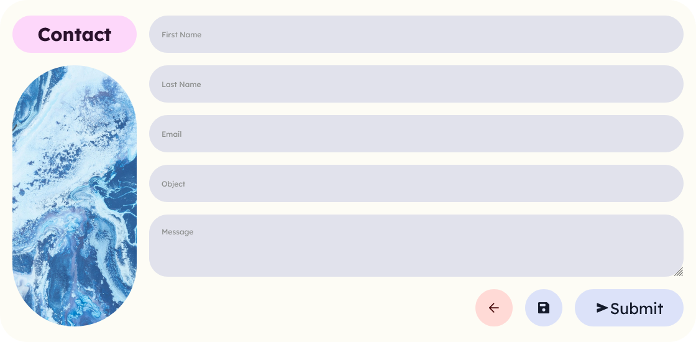

# m3 Contact Form

  
  
  
  

📧 A Material You inspired contact form (front-end only).
 
✨ Subtle animations.
 
🌌 Vanilla CSS.

  

---

This is a contact form designed to be both beautiful and functional. This is only the front-end, but I made it as simple as possible integrating logic and back-end.

Latest release [here](https://github.com/ziadOUA/m3-Contact-Form/releases/latest).

To clone the repository :

    git clone https://github.com/ziadOUA/m3-Contact-Form.git

Illustration by <a href="https://unsplash.com/@pawel_czerwinski?utm_source=unsplash&utm_medium=referral&utm_content=creditCopyText">Pawel Czerwinski</a> on <a href="https://unsplash.com/fr/photos/AV06Lm42mVo?utm_source=unsplash&utm_medium=referral&utm_content=creditCopyText">Unsplash</a>
  

 

  
  <picture>
    <source media="(prefers-color-scheme: dark)" srcset="https://i.postimg.cc/KzPKjBNn/footer-Dark.png">
    <source media="(prefers-color-scheme: light)" srcset="https://i.postimg.cc/C5wRq5P9/footer-Light.png">
    
  </picture>

  

